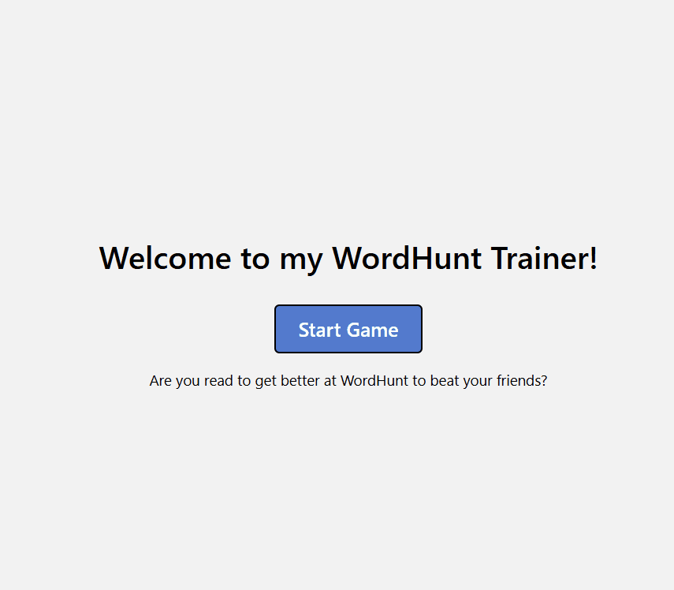

# Word Hunt Trainer App

This is an project made wwith react Native, typescript and Expo](https://expo.dev) 
It creates a replica of the popular WordHunt game from iphone's GamePigeon and has a board solver to display the highest possible scoring words (trie) updated in real time to train pattern recognition for the user. 


<p align="center">
  
</p>


## Running the app for yourself!


   ```bash
   git clone https://github.com/IanWorldHi/Word-Hunt-Trainer-Appf.git
   cd Word-Hunt-Trainer-Appf
   npm install
   npx expo start
   ```


<!-- Future Improvement: Haptic feedback, animation, remove stacking screens, maybe add customization for if web or app ie diff spacing and diff board randomization (ore vowels, easy consnants and s,r,d) -->


