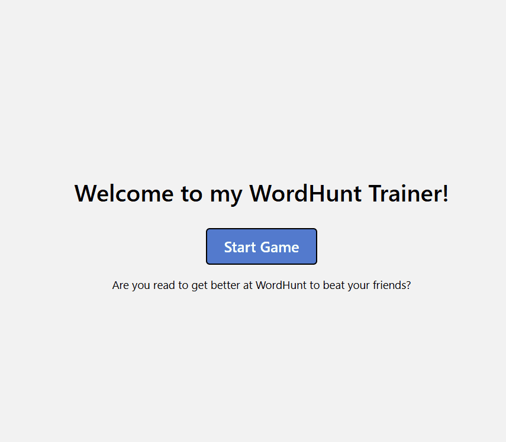

# Word Hunt Trainer App

- Frontend: React Native, Expo, TypeScript, Expo Router, Context API
- Backend: Node.js, Express.js
- Database: PostgreSQL
- Cache: Redis
- Auth: JWT, bcrypt, expo-secure-store
- Deployment: Railway

Replica of the popular game WordHunt from iphone's GamePigeon using a trie, an authetnication server and a data serrver. Additionaly contains a board solver displaying the highest possible scoring words updated in real time and haptic feedback. Designed as a training app to both play the game and improve pattern recognition in the game. 

(Currently ran out of Railway free trial, will not work plus troubleshooting something)

<p align="center">
  
</p>

## Running the app for yourself!


   ```bash
   git clone https://github.com/IanWorldHi/Word-Hunt-Trainer-Appf.git
   cd Word-Hunt-Trainer-Appf/client
   npm install
   npx expo start
   ```

### Improvements Roadmap
- Remove/restructure stacking screens
- Add better algorithm for board creation
- Add local developement setup isntructions

<!-- 
(Rough work/notes moved to Storage)
-->

